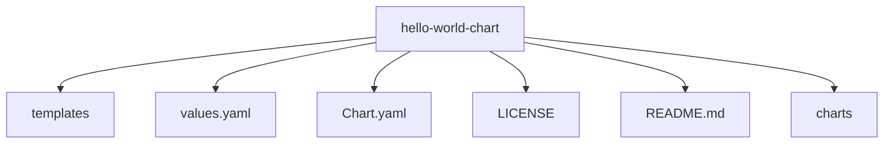

# 🍨 Section12 - Helm Basics

## What is Helm


객체를 생성하기 위해서는 모든 yaml 파일을 apply 해야 함 → 번거로움.


troubleshooting 시 issue를 찾는 것도 어려움.


Kubernetes는 우리 앱 전체에 대해 별로 신경 쓰지 않음. 우리가 알고 있는 것은 다양한 객체를 선언했고, 그것이 각각의 객체를 우리 클러스터 내에 존재하게 만든다는 것 뿐.


Helm은 그러한 것들에 대해 알기 위해 처음부터 기본적으로 설계되었음. 때때로 Kubernets 패키지 매니저라고 불림. 객체들을 그룹으로서 큰 패키지의 일부로 보고, 우리가 작업을 수행해야 할 때마다 헬름에게 어떤 객체를 만져야 하는지 말하지 않고, 어떤 패키지에서 작업할지만 알려줌. 그리고 패키지 이름에 따라 해당 패키지에 속하는 수백 개의 객체가 있더라도 어떤 객체를 어떻게 변경해야 하는지 알 수 있음.


```bash
helm install wordpress
helm upgrade wordpress
helm rollback wordpress
helm uninstall wordpress
```


## Installation and Configuration


Helm 설치 전에 먼저 로컬 컴퓨터에 적절한 로그인 세부 정보를 사용하여 기능적인 Kubernetes 클러스터와 kubectl을 설치하고 구성해야 함. 이를 위해 kubeconfig 파일이 의도한 Kubernetes 클러스터와 함께 작동하도록 설정해야 함.


[bookmark](https://helm.sh/docs/intro/install/#from-script)


## Lab:Installing Helm

1. controlplane node 위에 helm 패키지 설치
2. helm이 설치됨. 클러스터 내 helm version 확인

    

3. helm이 Debug 모드에서 실행 중인지 여부를 나타내는 데 사용할 수 있는 환경 변수는 무엇인가?

    

4. 장황한 출력을 가능하게 하는 데 사용할 수 있는 명령줄 플래그는 무엇인가?

    `--debug`

5. `helm get` 명령어와 사용할 수 있는 subcommnad가 아닌 것은?

    


## A quick note about Helm2 vs Helm3


Helm3에서 Tiller 없앰. Helm과 클러스터 사이에는 아무것도 존재하지 않음. 또한 RBAC를 사용하면 보안이 훨씬 향상되고 모든 사용자가 Helm으로 할 수 있는 작업에 제한을 받을 수 있음. 이전에는 Tiller에서 이러한 제한을 설정해야 했는데, 좋은 선택은 아니었지만, RBAC가 Kubernetes에서 사용자 권한을 미세 조정하기 위해 처음부터 구축되었기 때문에 이제는 간단하게 할 수 있음.


|                                 | Helm2 | Helm3 |
| ------------------------------- | ----- | ----- |
| Tiller                          | ✅     | ❌     |
| Three-way Strategic Merge Patch | ❌     | ✅     |


 helm으로 설치하고 kubectl로 이미지를 바꿈. rollback을 하려고 할 때 helm에서 현재 버전은 이전 버전으로 알고 있으므로 변화를 감지하지 못 하여 rollback을 하지 않음. helm2는 이전 차트를 가지고 현재 차트와 비교. 사용자가 수동으로 바꿨기 때문에 여전히 바꾼 버전으로 동작.


반면에 helm3의 경우 사용 중인 현재 차트를 비교. 되돌리고 싶은 차트와 라이브 상태, 그리고 현재 kubernetes 객체들이 yaml 형태로 선언된 것처럼 보이는 모습은 three-way merge patch 이름에서 유래됨.


[bookmark](https://helm.sh/docs/faq/changes_since_helm2/)


## Helm Components


차트는 파일 모음. Kubernetes 클러스터에서 필요한 객체 모음을 만들기 위해 Helm이 알아야 할 모든 지침를 포함하고 있음.


릴리스는 helm 차트를 사용하여 애플리케이션을 단일 설치하는 것. 각 릴리스마다 여러 개의 수정본을 가질 수 있으며, 각 수정본은 애플리케이션의 스냅샷과 같음.


다른 사람이 helm을 통해 릴리스 작업을 해야 한다면, 이 데이터의 사본이 필요할 것. helm은 이 메타데이터를 kubernetes 클러스터에 직접 저장하여 kubernetes secret으로 만듦. 이렇게 하면 데이터가 유지되고, 쿠버네티스 클러스터가 유지되고 팀의 모든 사람이 접근할 수 있는 한 헬름 업그레이드 등 원하는 모든 작업을 수행 가능.


## Helm charts


deployment와 서비스라는 두 가지 객체가 있음. 그리고 이미지의 일부를 배포하는 표준 deployment와 이를 노드 포트 서비스로 노출하는 서비스. 그러나 이미지 이름과 복제본이 다른 형태로 지정되어 있다는 것을 알 수 있음. 이것을 templating. 여기서 values는 values.yaml의 일부.


두 파일(deployment.yaml과 service.yaml)은 템플릿. values.yaml 파일로 values를 사용하여 커스터마이징.


values.yaml 파일 외에도 모든 차트에는 chart.yaml 파일이 있음. 여기에는 차트 자체에 대한 정보가 포함되어 있으며, 예를 들어 차트 API 버전은 V1 또는 V2일 수 있음. 애플리케이션 버전을 지정하는 데 사용되는 앱 버전도 있음.


helm3는 apiVersion을 v2로 설정.


type은 application과 library 두 가지가 있음. 기본적으로 application. library는 차트 빌드를 돕는 유틸리티를 제공.


dependencies. 여기서 wordpress 애플리케이션은 2-tier 애플리케이션. database는 mariadb로 자체 helm차트를 갖고 있음. dependency로 추가.


keywords 리스트는 public chart repository에서 차트를 찾을 때 유용.


maintainers부분은 maintainers의 정보가 있음.


home같은 optional 필드가 있음. icon은 icon의 url과 프로젝트 홈페이지의 url을 공유하는 데 사용됨.





## Working with Helm:basics


## Customizing chart parameters


## Lab:using Helm to deploy a chart

1. kubernetes 클러스터 내에서 애플리케이션, 도구 또는 서비스를 실행하는 데 필요한 모든 리소스 정의를 포함하는 helm package로 알려져 있음.

    chart

2. 같은 kubernetes 클러스터 위에 여러 번 같은 chart를 설치할 수 없음. False
3. Artifact Hub로부터 helm chart 패키지 wordpress를 찾기 위해 사용되는 명령어는?

    ```yaml
    helm search hub wordpress
    ```

4. Artifact hub로부터 consul helm chart 패키지를 찾고 Official HashiCorp Consul Chart에 대한 API  VERSION을 확인

    

5. controlplane node에 bitnami helm chart repository 추가

    ```yaml
    helm repo add bitnami https://charts.bitnami.com/bitnami
    ```

6. 새로 추가된 bitnami repository로부터 wordpress 패키지를 찾기 위해 사용된 명령어는?

    

7. controlplane node에 helm chart repositories 수
8. bitnami repository로부터 apache를 사용하여 클러스터에 Apache 애플리케이션 배포

    ```yaml
    helm install amaze-surf bitnami/apache
    ```

9. helm chart를 사용하여 클러스터에 설치된 apache 버전

    

10. 현재 클러스터에 설치된 nginx chart release 수

    

11. 클러스터에서 nginx chart release happy-browse를 제거

    ```yaml
    helm uninstall happy-browse
    ```

12. 클러스터에서 Hashicorp helm repository 제거

    ```yaml
    helm repo remove hashicorp
    ```


## Lifecycle management with Helm


명령줄에 매개변수를 추가하면 쉽게 해결할 수 있음. 하지만 왜 이런 일이 발생할까? 이 경우 Helm은 일부 관리 비밀번호에 액세스하지 않고는 모든 것을 업그레이드할 수 없음. 필요한 변경 권한을 얻기 위해서는 데이터베이스와 WordPress 웹사이트 자체에 대한 관리 권한이 필요. 또한 모든 롤백이 백업 복원 기능과 매우 유사하다는 점도 언급할 가치가 있음. 이 기능은 우리 애플리케이션에서 생성할 수 있는 파일이나 디렉토리 데이터를 다루지 않음. 대신 Helm은 Kubernetes 객체의 선언문 또는 매니페스트 파일을 백업하고 복원. 따라서 외부 데이터베이스와 같이 지속적인 볼륨이나 다른 형태의 지속적인 데이터를 사용하는 경우 롤백을 통해 해당 데이터도 복원할 수 없음.


따라서 차트를 업그레이드하기 전에 데이터베이스를 일관되게 백업하거나 데이터베이스를 롤백하거나 복원할 수 있는 옵션이 있지만, 이를 차트 훅이라고 하는 방법을 사용하여 수행할 수 있음.


## Lab:upgrading a helm chart

1. 클러스터에 bitnami helm repository 추가

    ```yaml
    helm repo add bitnami https://charts.bitnami.com/bitnami
    ```

2. 현재 클러스터 내에 nginx의  release 수
3. 클러스터에 존재하는 nginx의 수정본 수 ➡️ 3
4. 클러스터에서 현재 실행 중인 nginx의 version

    

5. DevOps 팀이 nginx버전을 1.27.x로 업그레이드하기로 함. bitnami repository에서 helm chart verion 18.3.6 사용.

    ```yaml
    helm upgrade --install dazzling-web bitnami/nginx --version 18.3.6
    ```

6. 현재 업그레이드 된 nginx 버전

    

7. web site에 문제 발생. 이전 버전으로 nginx rollback

    ```yaml
    helm rollback dazzling-web 2
    ```


    helm history <release name>을 사용하여 REVISION 값을 알아낼 수 있음.

