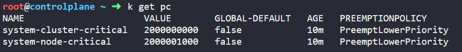
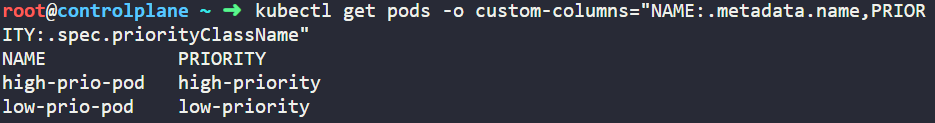
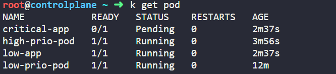

# 🍨 Section3 - Scheduling

## Manual Scheduling


## Practice Test-Manual Scheduling


## Labels and Selectors


## Practice Test-Labels and Selectors


## Taints and Tolerations


## Practice Test-Taints and Tolerations


## Node selectors


## Node Affinity


## Practice Test - Node Affinity


## Test and Tolerations vs Node Affinity


## Resource Requirements and Limits


## A quick note on editing Pods and Deployments


## Practice Test-Resource Requirements and Limits


## DaemonSets


## Practice Test - DaemonSets


## Static Pods


## Practice Test - Static Pods


## Priority Classes


## Practice Test - Priority Classes

1. 다음 Priority Class들 중 default kubernetes 설정의 일부인 것은?

    system-cluster-critical

2. `system-node-critical` 에 할당된 priority 값은?

    

3. system-node-critical에서 `preemptionPolicy` 의 값은?
4. 값은 100000, PreemptLowerPriority, `high-priority` 라는 이름을 가진 PriorityClass 생성. global 기본으로 설정하지 말기.

    ```bash
    k create pc high-priority --value=100000 --preemption-policy='
    PreemptLowerPriority' --global-default=false
    priorityclass.scheduling.k8s.io/high-priority created
    ```

5. 1000의 값을 가진 `low-priority`라는 이름의 또 다른 PriorityClass를 생성. global default로 설정하지 말기.

    ```bash
    k create pc low-priority --value=1000 --global-default=false
    priorityclass.scheduling.k8s.io/low-priority created
    ```

6. 기본 네임스페이스에 `nginx` 이미지로 실행하고 `low-priority` 라는 PriorityClass를 사용하는 `low-prio-pod`라는 이름을 가진 pod 생성.

    ```yaml
    apiVersion: v1
    kind: Pod
    metadata:
      name: low-prio-pod
    spec:
      containers:
      - name: nginx
        image: nginx
      priorityClassName: low-priority
    ```

7. 기본 네임스페이스에 `nginx` 이미지로 실행하고 `high-priority` 라는 PriorityClass를 사용하는 `high-prio-pod`라는 이름을 가진 또 다른 pod 생성.

    ```yaml
    apiVersion: v1
    kind: Pod
    metadata:
      name: high-prio-pod
    spec:
      containers:
      - name: nginx
        image: nginx
      priorityClassName: high-priority
    ```

8. 다음 명령어를 사용하여 두 파드의 priority class 비교 가능.

    

9. `low-app` 이라는 이름을 가진 파드, `critical-app` 이라는 이름을 가진 파드가 프로비저닝 되어있음. `kubectl get pods` 를 사용하여 pod 상태 확인.

    


    다음 중 옳은 것은?


    critical-app pod pending and low-app pod running

10. 높은 리소스를 요청하고 `low-app` pod가 스케줄링되었기 때문에 `critical-app` pod는 Pending 상태에 빠짐. 다음 명령어를 사용하여 `critical-app` 파드 상태 확인하기.

    ```bash
    kubectl describe pod critical-app
    
    Events:
      Type     Reason            Age                   From               Message
      ----     ------            ----                  ----               -------
      Warning  FailedScheduling  4m2s (x2 over 9m10s)  default-scheduler  0/1 nodes are available: 1 Insufficient cpu, 1 Insufficient memory. preemption: 0/1 nodes are available: 1 No preemption victims found for incoming pod.
    ```

11. `critical-app` 이 running 상태를 가지고 이 상황을 해결하기 위해 다음을 수행.
    - Assign the `high-priority` class to the `critical-app`
    - Delete and recreate the pod with the new priority

    반드시 조치를 취한 후 running 상태가 되어야 함.


    ```bash
    root@controlplane ~ ➜  k get po critical-app -o yaml > critical-app.yaml
    
    root@controlplane ~ ➜  vi critical-app.yaml 
    
    root@controlplane ~ ➜  k delete po critical-app --force
    Warning: Immediate deletion does not wait for confirmation that the running resource has been terminated. The resource may continue to run on the cluster indefinitely.
    pod "critical-app" force deleted
    
    root@controlplane ~ ➜  k apply -f critical-app.yaml 
    pod/critical-app created
    
    root@controlplane ~ ➜  k get po
    NAME            READY   STATUS    RESTARTS   AGE
    critical-app    1/1     Running   0          7s
    high-prio-pod   1/1     Running   0          17m
    low-app         1/1     Running   0          16m
    low-prio-pod    1/1     Running   0          25m
    ```

> priority class 8월 22일 추가

## Multiple Schedulers


## Practice Test - Multiple Schedulers


## Configuring Scheduler Profiles


## Admission Controllers


NodeRestriction과 NamespaceAutoProvision은 현재 NamsapceLife Cycle Admission Controller로 바뀜.


## Practice Test - Admission Controllers


## Validating and Mutating Admission Controllers


NamespaceExists나 NamespaceLifecycle Admission Controller는 namespace가 이미 존재하는지 확인하고 존재하지 않으면 요청을 거절하는 데 도움이 된다.


DefaultStorageClass plugin


PVC 생성 요청을 받음 없으면 요청을 수정하여 추가.


PVC를 생성하거나 관찰할 때, 비록 생성하는 동안 명시되지 않지만 StorageClassDefault는 그것을 추가한다.


Mutating Admisison Controller는 생성되기 전에 객체 자체를 바꿀 수 있다.


Validating Admission Controller는 요청을 확인하고 승인하거나 거절할 수 있다.


요청을 확인할 뿐만 아니라 바꿀 수 있는 admission controller가 있을 수도 있다.


통상적으로는 Mutating Admission Controller가 먼저 야기하고, Validating Admission Controller가 그 뒤를 따른다.


NamespaceAutoProvision which is a mutating admission controller, is run first, followed by the validating controller, NamespaceExists은 존재하지 않는 namespace에 대한 요청을 거절하다.


NamespaceAutoProvision은 결코 없는 namespace를 생성하지 않을 것이다.


MutatingAdmissionWebhook과 ValidatingAdmissionWebhook → 외부 Admission Controller


스스로 로직을 변경하거나 확인할 수 있도록 할 수 있음.

1. admission webhook 서버 배포
2. webhook-service로 webhook 서버 접근

mutationwebhook을 배포하면 기존에 있던 pod가 삭제됨.


## Practice Test - Validating and Mutating Admission Controllers

1. NamespaceAutoProvision은 Mutating admission controller
NamespaceExists는 Validating admission controller
2. admissino controller의 요청 흐름
mutating → validating
3. webhook-demo namespace 생성
4. webhook-server-tls 생성

```shell
kubectl create secret tls webhook-server-tls --cert=/root/keys/webhook-server-tls.yaml --key=/root/keys/webhhok-server-tls.key -n webhook-demo
```

1. 정의되어있는 webhook-deployment.yaml로 webhook 서버 배포
2. webhook-service.yaml로 서비스 배포
3. webhhok-configuration.yaml로 MutatingWebhookConfiguration을 추가하면 무슨 일이 발생하는가?
→ yaml 파일에 아래와 같은 규칙이 명시되어있으므로 Pod with CREATE operations

```yaml
rules:
  - operations: [ "CREATE" ]
    apiGroups: [""]
    apiVersion: ["v1"]
    resources: ["pods"]
```

1. webhook-configuration.yaml 생성
2. 이전 단계에서 아래의 조건을 가진 데모 웹훅을 배포함.
- securityContext를 제공하지 않으면 컨테이너에서 root로 운영하는 모든 파드에 대한 요청을 거절.
- runAsNonRoot에 대한 값을 설정하지 않으면 기본적으로 true, 그리고 사용자 ID는 기본적으로 1234
- securityContext에서 runAsNonRoot를 false라고 정확하게 명시하면 루트로 운영하도록 허용.
3. pod-with-defaults.yaml로 파드를 생성→ securityContext가 없는 파드가 생김.
webhook 없다면 root 유저로 운영될 것이다. webhook은 uid1234를 가진 non-root 유저로 운영하기 위해 파드를 변경한다.
4. 10번에서 생성한 pod는 runAsNonRoot는 true이며, runAsUser는 1234이다.
Configuration에 따라 securityContext가 없으므로 runAsNonRoot와 runAsUser는 모두 기본값을 가진다.
5. pod-with-override.yaml로 파드 생성 → 루트 유저로 운영되도록 하는 securityContext를 가진 파드
webhook을 갖고 갖지 않고 배포의 결과는 같음.
명확하게 함으로써 Webhook으로 더 많은 보안이 설정되는 것을 막음.
6. pod-with-conflict.yaml로 파드 생성 → 
설정 없이 루트 유저로 운영하도록 하는 요청을 거절할 것.

    ```bash
    kubectl apply -f /root/pod-with-conflict.yaml
    Error from server: error when creating "/root/pod-with-conflict.yaml": admission webhook "webhook-server.webhook-demo.svc" denied the request: runAsNonRoot specified, but runAsUser set to 0 (the root user)
    ```

